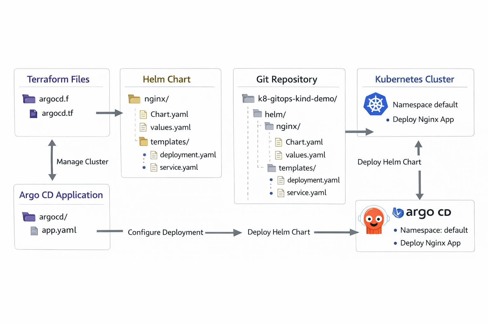

🌐 GlobalSend Kubernetes GitOps Deployment - local lab
Automated Multi‑Environment Deployment | Helm, KIND, Terraform, Argo CD, Prometheus, Grafana  

Kubernetes | Helm | Terraform | ArgoCD | Prometheus | Grafana | KIND | GitHub Actions  

---

🚀 **Overview**  
GlobalSend Kubernetes GitOps Deployment provides a fully automated workflow for deploying the GlobalSend application in a local or cloud Kubernetes environment. The setup leverages KIND for local cluster provisioning, Terraform for infrastructure management, and Argo CD for GitOps-driven continuous delivery.  

The deployment includes monitoring via Prometheus and Grafana, enabling observability and metrics collection from all services. Helm charts are used for packaging and deploying both core application and monitoring components.  

**Highlights:**  
- Automated GitOps deployment of GlobalSend application  
- Local KIND cluster for development and testing  
- Integrated monitoring with Prometheus and Grafana  
- Reproducible infrastructure with Terraform  
- Automated Helm releases via Argo CD  
- NodePort services for local access  

---

🏗 **Architecture**  

**End‑to‑End Flow:**  
Local Development → GitHub → GitHub Actions → Terraform → KIND Cluster → Argo CD → Helm Charts → Prometheus/Grafana → GlobalSend App  

### Architecture Diagram
    


---

### Fraud Dashboard


     

---

---

⚡ **Key Components**  

| Component                 | Technology                          | Purpose |
|----------------------------|------------------------------------|---------|
| Local Cluster              | KIND                               | Provision local Kubernetes environment |
| Application Deployment     | Helm, Kubernetes                   | Deploy GlobalSend app in cluster |
| GitOps Automation          | Argo CD                            | Continuous deployment from Git repo |
| Monitoring & Metrics       | Prometheus, Grafana                | Collect and visualize metrics |
| Infrastructure as Code     | Terraform                          | Manage cluster resources and namespaces |
| CI/CD Pipeline             | GitHub Actions                     | Automate sync and deployments |
| Service Exposure           | NodePort / ClusterIP               | Access app and monitoring locally |

---

🔧 **Multi‑Environment Strategy**  

| Environment | Branch  | Deployment Trigger |
|-------------|---------|------------------|
| Development | dev     | Push to dev       |
| Staging     | staging | Merge dev → staging |
| Production  | main    | Merge staging → main via GitOps |

**Pipeline Features:**  
- Automatic environment detection from branch  
- Terraform provisioning of namespaces and cluster resources  
- Helm chart deployment with Argo CD  
- Automated monitoring stack deployment (Prometheus + Grafana)  
- NodePort exposure for local testing  

---

🗂 **Project Structure**  

```
globalsend-k8-gitops/
├── helm/globalsend/           # Helm chart for GlobalSend app
│   ├── Chart.yaml
│   ├── values.yaml
│   └── templates/
│       ├── deployment.yaml
│       ├── service.yaml
│       └── namespace.yaml
├── terraform/                 # Infrastructure as Code
│   ├── main.tf
│   └── modules/
│       ├── kind/
│       └── monitoring/
├── .github/workflows/         # CI/CD pipeline
│   └── deploy.yml
└── README.md

```

---

🛡 **Security & Best Practices**  
- Environment Isolation: Separate namespaces for monitoring, Argo CD, and GlobalSend  
- GitOps Workflow: Argo CD ensures declarative, reproducible deployments  
- Helm Best Practices: Versioned charts and configurable values  
- Infrastructure Validation: Terraform ensures predictable cluster provisioning  

---

📝 **Usage**  

**Local Development**  

git clone <repo-url>
cd globalsend-k8-gitops
terraform init
terraform apply -auto-approve  # Creates KIND cluster, namespaces, monitoring
````

**Deploy Application via Argo CD**

* Ensure `globalsend` namespace exists
* Argo CD Application will sync Helm chart to cluster
* Monitor deployments in Argo CD UI

**Access Services**

* Prometheus: `http://localhost:<prometheus_nodeport>`
* Grafana: `http://localhost:<grafana_nodeport>`
* GlobalSend App: `http://localhost:<globalsend_nodeport>`

---

👨‍💻 **Tech Stack**

* Kubernetes: KIND, Helm, Argo CD
* Monitoring: Prometheus, Grafana
* IaC: Terraform
* CI/CD: GitHub Actions
* Containerisation: Docker

---

📬 **Contact**
For questions about GitOps deployment or monitoring setup, contact the GlobalSend DevOps Team.

---

📜 **Licence**
MIT License
Last updated: February 2026

```
